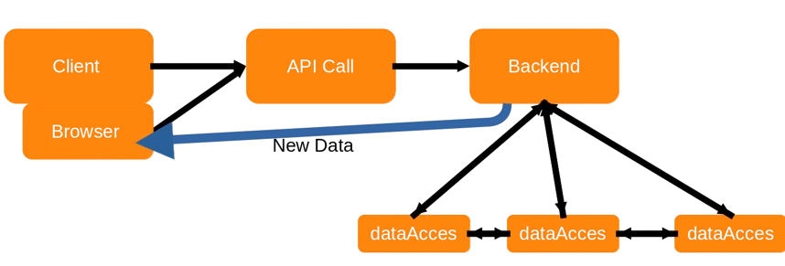

# Backend
> In this document we will try to explain the working loop and add some general information about the backend.

Our goal was to minimise the server load, and try to offload functionality to the clients. Thus, using the resources of the server in an efficient manner.  
That is why we created the game upon a user-interactive basis. Functionality on the server will only be executed when a user interacts with the frontend of the website.

| File Overview    | Use Case                                                                                                          |
|------------------|-------------------------------------------------------------------------------------------------------------------|
| app.py           | Root file in which the actual Flask app is set up, where all APIs are listed and where functionality is delegated |
| wsgi.py          | Production Server                                                                                                 |
 | database.py      | Database Connection using psycopg2                                                                                |
| preset.py        | A debug script to preset basic game data                                                                          |
| querry.py        | The schema.sql script in string format                                                                            |
| requirements.txt | Python Dependencies                                                                                               |
| dataAcces        | Library containing the core functionality, which is explained in the other files                                  |

## Workflow

The user interacts at first with the backend. This can be done by clicking buttons or just opening the site. Upon click, the user ittself will request new data, e.g. when the resource refresh button is clicked or when the map is opened, new data will be retrieved. 
In the background from the user, certain scripts will be executed to keep in sync with the server and other players. Refer to the specific [backend](timer.md) & frontend documentation.

Once an API request/call is made, the backend will delegated certain functionality to smaller dataAcces components and return those results to the web browser. The dataAcces components might work together. 

### app.py

In this file our actual [Flask App](https://flask.palletsprojects.com/en/3.0.x/) is specified. Each dataAcces is initialised as a Singleton Service, providing globally unique acces to each data component.

### wsgi.py

The production server simply inherits the app as specified in app.py. 

### database.py

Here the Database Connection to our Postgresql Database is specified. It is based on the files provided by the Teaching Assistants of this course using [psycopg2](https://pypi.org/project/psycopg2/)
It builds an abstraction layer to the connection. 

### preset.py

A simple script cross using direct database acces as well as game functionality to provided a basic working game with presetted demo for demo's.

### dataAcces

This folder contains functionality, tried to be sorted by each Database Class. However, to avoid duplicated code, different components use functionality from each other. 
This functionality is further explained in the other backend documentation files.

Each dataAcces component has (multiple) Python Classes which are a translation of the database Entities to ease working with them in the python backend.
They always provide the to_dct() function, which will output the class in a python dictionary format.

The dataAcces component itself uses these python objects to execute their respective functionality.

| DataAcces      | Explained in                 | Database Entities          |
|----------------|------------------------------|----------------------------|
| achievement.py | [achievement](achievement.md) | achievement & quest        |
| building.py    | [admin](admin.md)            | /                          | 
| building.py    | [building](building.md)      | building, buildable        |
| clan.py        | [social](social.md)          | clan                       | 
| content.py     | [social](social.md)          | content & derived entities |
| friend.py      | [social](social.md)          | friend                     |
| package.py     | [resources](resources.md)    | package                    |
| player.py      | [social](social.md)          | player                     | 
 | settlement.py  | [settlement](settlement.md)  | settlement                 |
 | soldier.py     | [soldier](soldier.md)        | soldier                    | 
| timer.py       | [timer](timer.md)            | timer                      |
| transfer.py    | [transfer](transfer.md)      | transfer                   |
