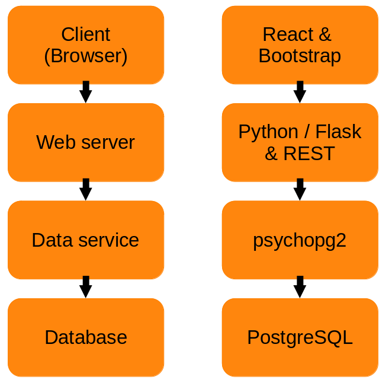

# Tools & Technology
> This documentation explains the use of different software packages & their organisation.
> > We value the folder structure!

**administration/**  This directory is used to store all University related files.

**documentation/** Used to keep all (technical) documentation files

**nginx/** Place of the webserver configuration

**service/** Stores the service file

**sql/** Contains the files to load or modify the database with

**src/frontend** All files from the React.js Frontend

**src/ and src/dataAcces** Files from the Flask Backend

### Use of Technology

> From frontend to backend
> 

1. HTML
2. CSS (Boostrap)
3. JS
4. React
5. REST API in psycopg2
6. Flask Framework (incl. Nginx & Gunicorn)
7. PostgreSQL Database

### Naming Conventions
> At least tried! :) 

1. Database tables are lowercase (single) words
2. Database table entities are lowercase (single) words
3. If Database table expresses a relation, referencing towards another table, the first letter from the referred table is added to the word. e.g. id becomes sid if it refers to a settlement id.
4. In the backend & APIs, the same name & identifiers are (mostly) used to ease references. 